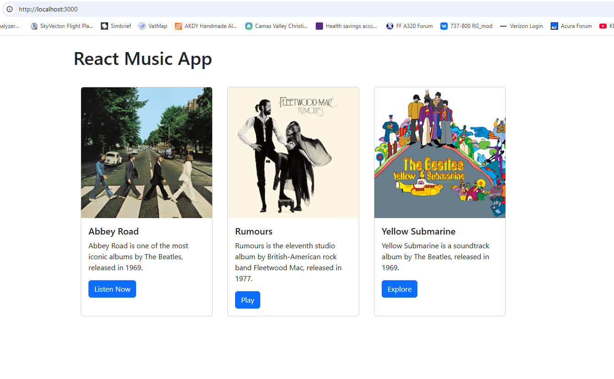
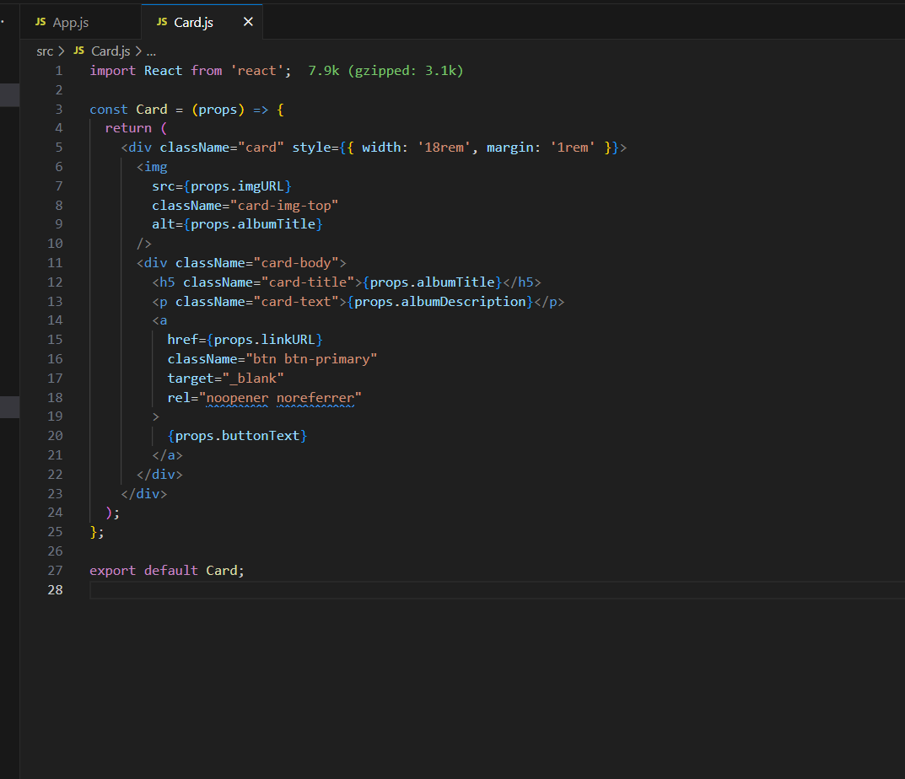
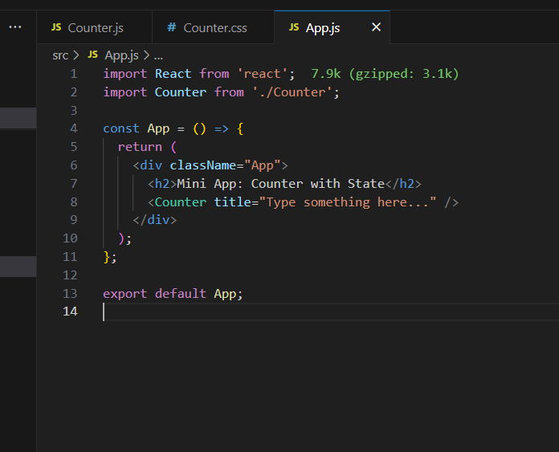
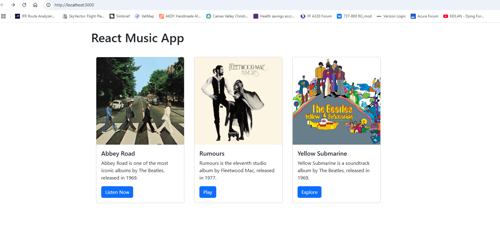
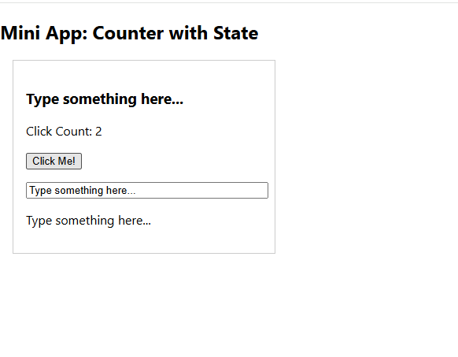
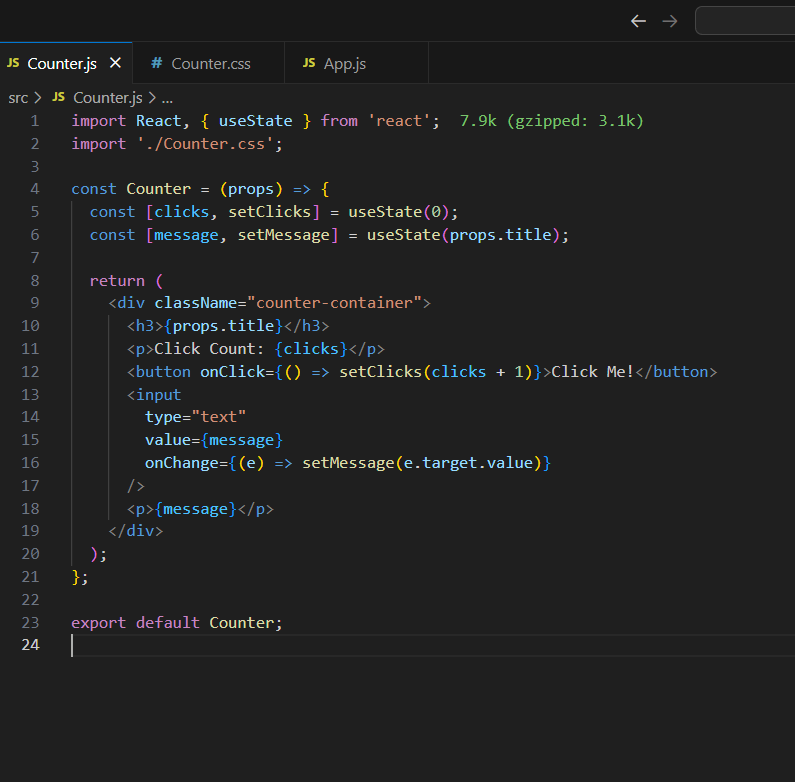
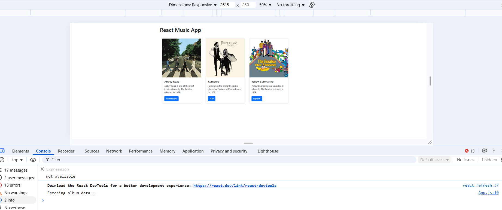
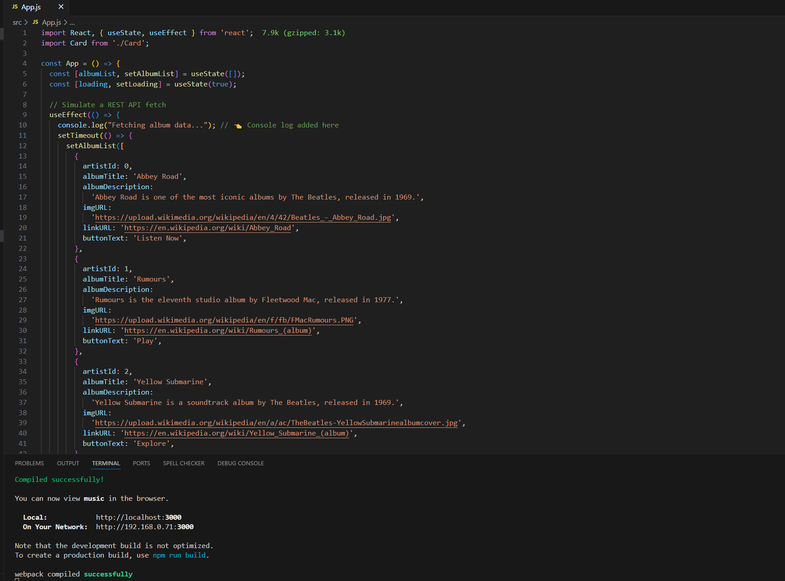
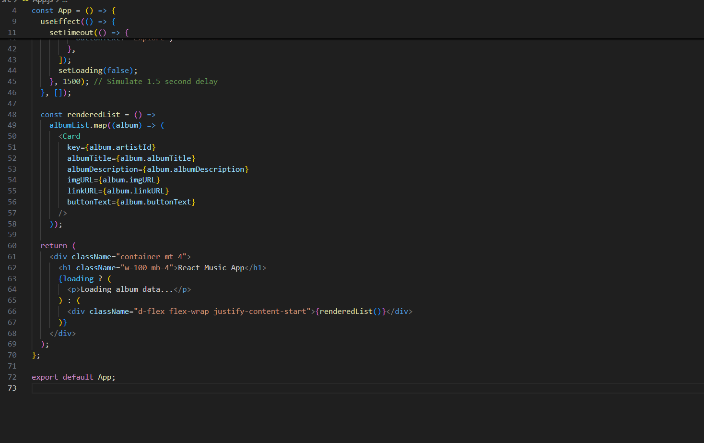
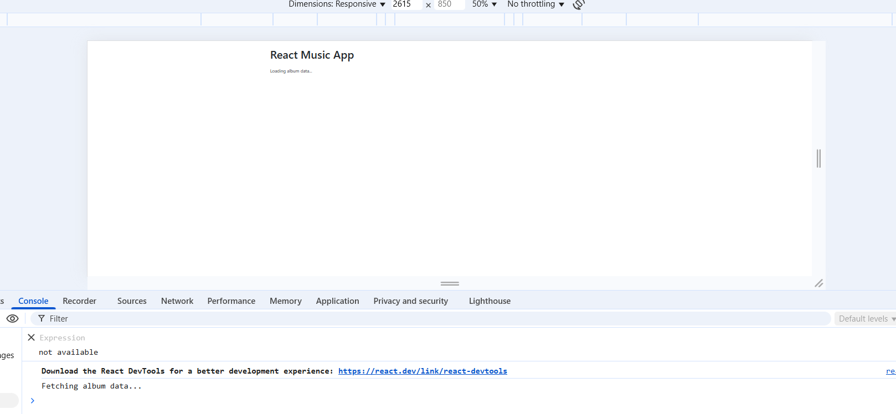

# CST-391: JavaScript Web Application Development  
## Activity 5: React Tools & Music App  
**Matt Kollar**  
📅 *04/01/2025*  

---

## ✅ Part 1: React Music App with Fixed Data

### 🎯 Summary of Completed Work

In this activity, I created a React-based music application featuring a reusable `Card` component to display music album details. I learned how to use **JSX**, **props**, and **functional components** to keep code modular and maintainable. Bootstrap 5 was added using a CDN for styling, enabling a responsive and clean UI. I structured the app with a parent `App` component that renders multiple `Card` components side-by-side using **Flexbox**. I also implemented working button links to external resources (Wikipedia) and ensured that card content is passed dynamically using component **props**.

### 📸 Screenshots & Captions

#### 🖼️ React Music App in Browser

#### 🖼️ Card Component Code

#### 🖼️ App Component Code

### 📘 One-Paragraph Feature & Terminology Summary

In this lesson, I learned how to create and use **custom React components** using **functional syntax** and how to pass data using **props**. A key React concept introduced is **JSX**, which looks like HTML but allows JavaScript logic inside UI declarations. I learned to import and render components like `<Card />`, and how each component can receive props such as `albumTitle`, `albumDescription`, `imgURL`, and `buttonText`. I also learned to use **Bootstrap 5** via CDN to apply clean styles like buttons and card layouts, and to structure layouts responsively using **Flexbox utilities** like `d-flex`, `flex-wrap`, and `justify-content-start`.

---

## ✅ Part 2: React Music App with State and Props

### 🎯 Summary of Completed Work

I refactored the app to use the `useState` hook and store all album data in a single state variable, `albumList`. I then used `.map()` to dynamically render each card based on the data in state. This improved maintainability and allowed the card list to be data-driven.

### 📸 Screenshots & Captions

#### 🖼️ React Music App – State-Based Rendering

#### 🖼️ App.js with useState and map()

### 📘 One-Paragraph Feature & Terminology Summary

In Part 2 of this activity, I refactored the React Music App to store album data using the `useState` hook, which enables components to manage internal state. Instead of hardcoding multiple `<Card />` components manually, I used the JavaScript `.map()` function to dynamically generate cards from an array of album data stored in the `albumList` state. This made the code more scalable and reusable. I also learned that each child in a list should have a unique `key` prop to help React optimize rendering. This part reinforced how props can be passed from a parent component (`App`) to a child component (`Card`) while maintaining clean and dynamic code.

---

## 🧮 Mini App #1: State Changer Demo (Counter)

### 🎯 Summary of Completed Work

This mini app demonstrates state management using two `useState` hooks — one for counting button clicks, and one for capturing and displaying text input. It reinforces controlled components and how props are used to initialize state.

### 📸 Screenshots & Captions

#### 🖼️ Counter Mini App in Browser

#### 🖼️ Counter Component Code

#### 🖼️ Counter App Wrapper

### 📘 One-Paragraph Feature & Terminology Summary

In this mini app, I created a `Counter` component to demonstrate multiple `useState` hooks in action. I learned how to manage and update state dynamically using a click handler and an input field. I also implemented a controlled component where the input field is tied to the component state via the `value` and `onChange` props. This helped reinforce the pattern of syncing UI and logic in React.

---

## ✅ Part 3: Simulating a REST API with useEffect

### 🎯 Summary of Completed Work

In Part 3, I refactored the app to simulate a REST API call using the `useEffect` hook and `setTimeout`. The album list now loads after a delay, as if being fetched from an external source. While loading, a “Loading album data...” message is shown. A `console.log` confirms when data is being "fetched."

### 📸 Screenshots & Captions

#### 🖼️ Simulated REST Fetch – Browser Output

#### 🖼️ useEffect – First Half

#### 🖼️ useEffect – Second Half

#### 🖼️ Console Log + Loading Message

### 📘 One-Paragraph Feature & Terminology Summary

In Part 3, I updated the React Music App to simulate retrieving album data from an external API. Instead of initializing state with a fixed list, I used the `useEffect` hook to delay the population of album data using `setTimeout`. This created the illusion of an asynchronous API call. I also displayed a “Loading...” message while the app waited for the data. This part of the assignment introduced the concept of side effects in React and how to manage them with `useEffect`. It also emphasized how modern React apps handle asynchronous data flow from REST APIs.

---

## 🎉 Activity 5 Completed - Thanks For Viewing!
